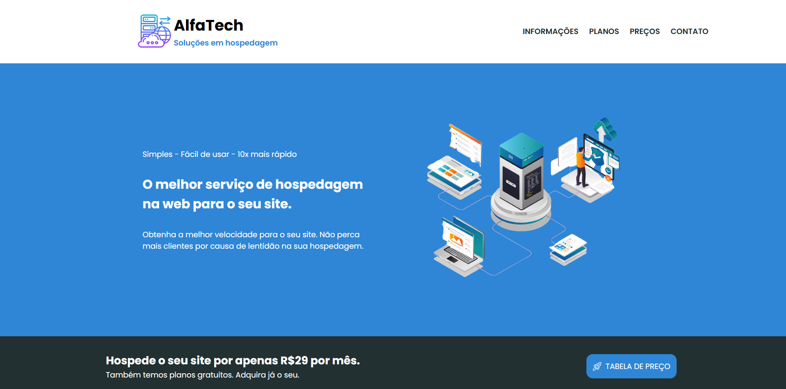

# 🌐 Projeto Provedor de Hospedagem

Projeto desenvolvido durante meus estudos de **Desenvolvimento Web**, com o objetivo de praticar a criação de uma página para um provedor de hospedagem, aplicando conceitos de **HTML5 e CSS3**.

O projeto simula o site de uma empresa de hospedagem, apresentando seus serviços, planos, informações e recursos oferecidos, com uma interface organizada e moderna.

---

## 📌 Sobre o projeto

O **Projeto Provedor de Hospedagem** foi desenvolvido como um projeto de aprendizado para colocar em prática os conhecimentos adquiridos durante meus estudos de desenvolvimento web.

A proposta foi criar uma página para uma empresa fictícia de hospedagem, trabalhando principalmente a estruturação do conteúdo, organização dos elementos e estilização da interface.

O projeto também conta com uma **página de planos**, apresentando diferentes opções de hospedagem e seus respectivos recursos.

> 📌 **Observação:** Este projeto não possui responsividade, tendo sido desenvolvido com foco na versão para desktop.

---

## 🚀 Tecnologias utilizadas

- HTML5
- CSS3

---

## 💻 Funcionalidades

- Página inicial com apresentação da empresa
- Seção de serviços
- Apresentação dos planos de hospedagem
- Tabela comparativa entre os planos
- Seção de informações e recursos
- Navegação entre as seções da página
- Navegação entre diferentes páginas do projeto

---

## 📚 O que aprendi

Durante o desenvolvimento deste projeto, pude praticar:

- Estruturação de páginas utilizando **HTML semântico**
- Organização de conteúdo utilizando diferentes elementos HTML
- Estilização de páginas utilizando **CSS**
- Utilização de **Flexbox**
- Organização e alinhamento de elementos
- Criação e estilização de **tabelas**
- Utilização de pseudo-classes no CSS
- Criação de efeitos visuais e detalhes de interface
- Trabalho com cores, fontes e imagens
- Navegação entre páginas utilizando links HTML
- Organização de arquivos e pastas de um projeto web

---

## 🌐 Acesse o projeto

<a href="https://projeto-provedor-ten.vercel.app" target="_blank">Acesse o site</a>   

---

## 📷 Preview

---

## 👨‍💻 Desenvolvido por

**Bruno Barros**

Desenvolvido como parte dos meus estudos em **Desenvolvimento Web**.